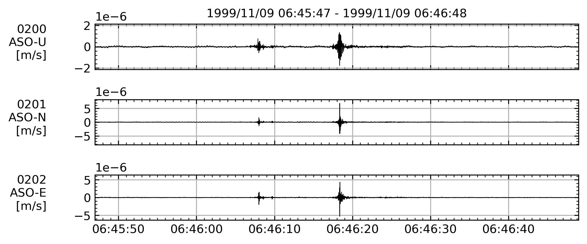
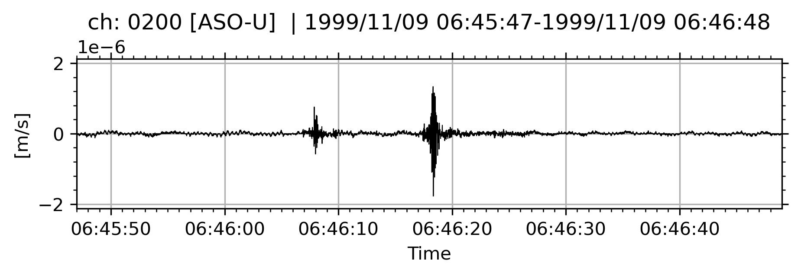

## 異なるチャンネルデータの結合
`WIN1ch`クラスや`WIN`クラスは，「+」で足すことで，異なるチャンネルのデータを結合できる．


## チャンネルの検索
`WIN.select`メソッドで，
観測点名や成分名を指定して`WIN`からチャンネルを抽出できる．
「*」や「.」(または「?」) によるワイルドカードも使用可能．

???+ example 
    ```python
    import wintools

    fp = "./etc/991109.064607"
    chtable = "./etc/991109.064607.ch"

    dat = wintools.read(
        fp,
        chtable=chtable,
        )
    dat.select(
        station="KAG",
        component="Z",
        )
    ```


## データの切り出し
### WINクラスから特定チャンネルの切り出し
`WIN`クラスのインスタンスからデータを取り出す．
`dat[0]`とか`dat["0200"]`，`dat[1:3]`,`dat[["0200","0201","0203"]]`
のように，インデックス番号の単体・スライスか，文字列のチャンネル番号の単体・リストを与えて，任意のチャンネルのデータを絞り出すことができる．

切り出し結果が単体チャンネルの場合は`WIN1ch`クラスが出力される．
切り出し結果，チャンネルが複数ある場合は`WIN`クラスが出力される．

### 時間方向の切り出し
`WIN.trim`メソッドを使う．
引数に与えた開始時間，終了時間の区間でデータを切り出す．
いずれかの時間を与えない（もしくはNone）場合，与えなかった方向には切り落とさない．

`contain_end`を`True`にすると，終了時間を含むように切り出す．
???+ example 
    ```python
    import wintools
    import datetime

    fp = "991109.064607"
    chtbl = "991109.064607.ch

    dat = wintools.read(
        fp,
        chtable = chtbl,
        encoding = "utf-8",
        apply_calib=True,
    )

    dat.trim(
        datetime.datetime(1999, 11, 9, 6, 46, 0),
        None,
        contain_end=True,
    )
    ```

## データのプロット
`WIN`や`WIN1ch`の`plot`メソッド．
`matplotlib`に準じて線のスタイルの引数を与えることができる．
また，fig, axを返すので，これを使って後からプロットのカスタマイズが可能．

`savefp`で保存先のパスを指定すると，画像を保存する．

???+ example "複数チャンネルデータのプロット"
    `WIN`クラスによるプロット．
    ```python
    import wintools
    import pandas as pd
    from wintools.lib.win.reader import core

    fp = "./etc/991109.064607"
    chtable = "./etc/991109.064607.ch"

    dat = wintools.read(
        fp,
        chtable=chtable,
        encoding = "utf-8",
        apply_calib=True,
        )
    dat[:3].plot()
    ```
    <figure markdown="span">
        { width=70% }
        <figcaption>複数波形のプロット</figcaption>
    </figure>

???+ example "単チャンネルデータのプロット"
    `WIN1ch`クラスによるプロット．
    `WIN`の0番目のデータをプロットしている．
    ```python
    import wintools
    import pandas as pd
    from wintools.lib.win.reader import core

    fp = "./etc/991109.064607"
    chtable = "./etc/991109.064607.ch"

    dat = wintools.read(
        fp,
        chtable=chtable,
        encoding = "utf-8",
        apply_calib=True,
        )
    dat[0].plot()
    ```
    <figure markdown="span">
        { width=70% }
        <figcaption>単数波形のプロット</figcaption>
    </figure>

## ObsPyとの連携
### ObsPyへの波形データ出力
`WIN`または`WIN1ch`クラスの`to_obspy`メソッドを使う．
`WIN1ch`であれば`obspy.Trace`を，
`WIN`であれば`obspy.Stream`を出力する．

WINファイルにデータがないネットワーク名，地域名は付与されない．

### ObsPyからWINオブジェクトへの変換
`wintools.from_obspy`関数を使う．
引数にobspyの`Trace`または`Stream`を与えると，それぞれ`WIN1ch`または`WIN`クラスを出力する．

また，`chtable`引数を与えると，`wintools.read`と同様にチャンネルテーブル情報を付加できる．

